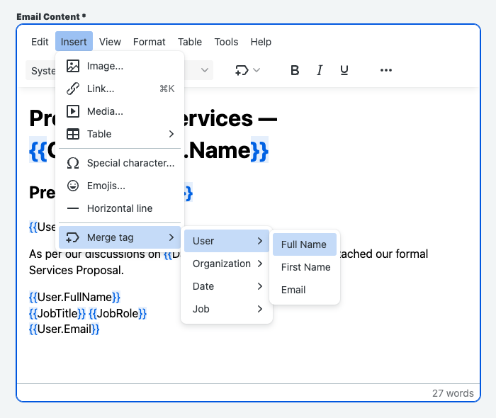

# TinyMCE

TinyMCE is a platform independent web based Javascript HTML WYSIWYG editor control released as Open Source under LGPL by Moxiecode Systems AB. It has the ability to convert HTML TEXTAREA fields or other HTML elements to editor instances. TinyMCE is very easy to integrate into other Content Management Systems.

## Plugins

TinyMCE is designed to be easily extended by custom plugins; with APIs for registering custom plugins, and creating and localizing custom UI.

### Requirements

To be recognized as a plugin by TinyMCE, the code for a custom plugin must have a JavaScript file with a single entry point that registers the plugin with TinyMCE using the PluginManager API. Any other code or resources can be in separate files and can be loaded in any standard manner. TinyMCE also has various APIs for loading scripts and stylesheets.

TinyMCE does not require any special file structure or tooling apart from these requirements, so custom plugins can be developed using most frameworks and tools.

Visit the [TinyMCE Plugin Tutorial](https://www.tiny.cloud/docs/tinymce/6/creating-a-plugin/) for more information on how to create a plugin.

## Custom Plugins

### Merge Tags Plugin



The Merge Tags plugin allows the user to insert a merge tag (also known as a personalization token, or a mail merge field).

Merge Tags can be inserted by selecting from a drop-down list when a specified prefix is typed, or selected and inserted from the searchable Merge Tags toolbar menu button.

Once a merge tag is inserted, the plugin leaves a non-editable variable wrapped with a prefix and suffix, making it easily identifiable.

TinyMCE offers a [premium plugin](https://www.tiny.cloud/docs/tinymce/6/mergetags/) available for paid subscriptions that provides a similar feature set. This Merge Tags plugin is a custom alternative that provides a subset of the premium plugin's features.

#### Getting started with TinyMCE Merge Tags

##### Basic setup

```javascript
tinymce.init({
  selector: 'textarea',
  plugins: 'mergetags',
  toolbar: 'mergetags',
  mergetags_list: [
    {
      title: 'Example merge tags list',
      menu: [
        {
          value: 'Example.1',
          title: 'Example one',
        },
        {
          value: 'Example.2',
          title: 'Example two',
        },
      ],
    },
  ],
});
```

**FUTURE FEATURE:**

The Merge Tags plugin provides an autocompleter for adding a merge tag without using the toolbar button or menu item.

The autocompleter is triggered by typing the `{{` prefix.

_Consideration:_ Entering characters after the prefix begins filtering the Merge Tags list.

##### Using Merge Tags

1. Merge Tags contents are non-editable but can have any inline-formats applied to them.

   For example, a merge tag can be set to any available typeface, type-size, foreground or background color, or can be set to bold, or italic.

2. Merge Tags can be changed.

   A selected merge tag can be changed to any other merge tag by using the Merge Tags toolbar menu button.

3. Text that matches an existing merge tag will be recognized as a merge tag when it is pasted or otherwise inserted into a TinyMCE document. (Currently, only after sourc code view or save.)

   Content containing the specified prefix and suffix, and matching a specified merge tag, will be inserted as a merge tag when pasted into the editor. For example, if `Sender.Firstname` is a merge tag value, adding the string, `{{Sender.FirstName}}`, to a TinyMCE document will result in the string automatically being recognized as a merge tag.

4. Merge Tags can be nested within the `mergetags_list` option.

   The `mergetags_list` option allows for the specification of a nested menu item within the Merge Tags toolbar menu button. This option allows any number of nested menus and items for merge tag categorization.

##### Styling Merge Tags

The visual appearance of the Merge Tags within the editor is styled by using custom CSS. Here is an example of how the Merge Tags elements are styled.

```css
.mce-content-body .mce-mergetag:hover {
  background-color: rgba(0, 108, 231, 0.1);
}

.mce-content-body .mce-mergetag-affix {
  background-color: rgba(0, 108, 231, 0.1);
  color: #006ce7;
}
```

Here is an example of the Merge Tags HTML structure.

```html
<span class="mce-mergetag">
  <span class="mce-mergetag-affix"></span>
</span>
```

##### Options

**mergetags_list**

`mergetags_list` is an object array that specifies the menu content used for merge tags insertion. Every object specifies the configuration of a submenu or a menu item.

If the `mergetags_list` option is not set, or contains no entries, both the Merge Tags toolbar button and the Merge Tags menu item are hidden.

**FUTURE FEATURE:** Merge tag autosuggestions are also disabled if the `mergetags_list` option is not set, or contains no entries.

Type: `Array`

###### Menu item properties

| Name  | Type   | Required | Description                                                            |
| ----- | ------ | -------- | ---------------------------------------------------------------------- |
| title | string | optional | If set: the menu item label to display instead of the `value`.         |
| value | string | required | The merge tag content to be inserted after the menu item is activated. |

###### Submenu properties

| Name  | Type   | Required | Description                                 |
| ----- | ------ | -------- | ------------------------------------------- |
| title | string | required | The submenu label to display.               |
| menu  | Array  | required | The list of nested submenus and menu items. |

##### Example: using mergetags_list

```JavaScript
tinymce.init({
  selector: 'textarea', // change this value according to your HTML
  plugins: 'mergetags',
  toolbar: 'mergetags',
  mergetags_list: [
    {
      value: 'Current.Date',
      title: 'Current date in DD/MM/YYYY format'
    },
    {
      value: 'Current.Time',
    },
    {
      title: 'Person',
      menu: [
        {
            value: 'Person.Name.First',
            title: 'first name'
        },
        {
            value: 'Person.Name.Last',
            title: 'last name'
        },
        {
            value: 'Person.Name.Full',
            title: 'full name'
        },
        {
            title: 'Email',
            menu: [
              {
                value: 'Person.Email.Work'
              },
              {
                value: 'Person.Email.Home'
              }
            ]
        }
      ]
    }
  ]
});
```

##### Toolbar buttons

The Merge Tags plugin provides the following toolbar buttons:

| Toolbar&nbsp;button&nbsp;identifier | Description                                                                                                                                                                                                                                                                                              |
| ----------------------------------- | -------------------------------------------------------------------------------------------------------------------------------------------------------------------------------------------------------------------------------------------------------------------------------------------------------- |
| mergetags                           | Menu toolbar button containing merge tags as a drop down list of nested menus and items. This list is specified by the `mergetags_list` option. When a merge tag is chosen from the menu it is then inserted into the content. This button also includes a search field for finding specific merge tags. |

These toolbar buttons can be added to the editor using:

- The `toolbar` configuration option.
- The `quickbars_insert_toolbar` configuration option.
- Custom Context toolbars.

##### Menu items

The Merge Tags plugin provides the following menu items:

| Menu&nbsp;item&nbsp;identifier | Default&nbsp;Menu&nbsp;Location | Description                                                                                                            |
| ------------------------------ | ------------------------------- | ---------------------------------------------------------------------------------------------------------------------- |
| mergetags                      | Insert                          | Inserts a merge tag from a nested menu. The nested menu contains the Merge Tags list, as specified in `mergetags_list` |

These menu items can be added to the editor using:

- The `menu` configuration option.
- The `contextmenu` configuration option.
- Custom Menu toolbar buttons.
